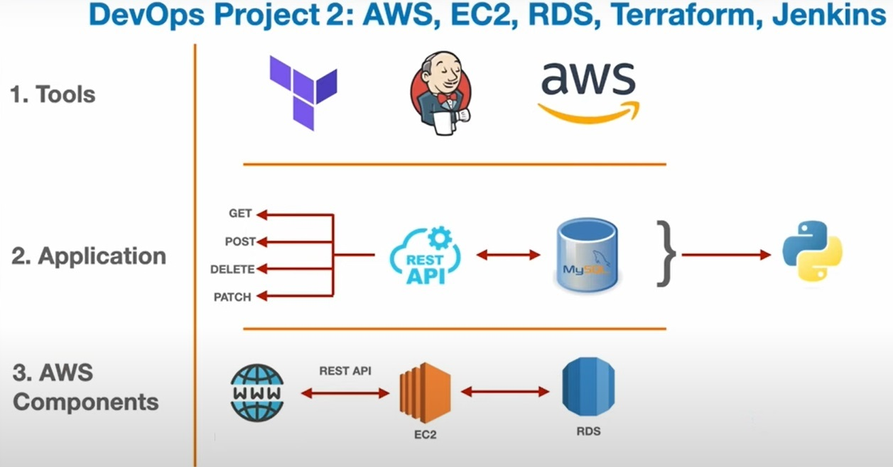

# Project 2: Terraform Jenkins Integration

Welcome to the Project 2 repository for Terraform Jenkins Integration. This project is designed to guide you through setting up an infrastructure using Terraform and integrating Jenkins for continuous integration. Follow the steps outlined below to successfully implement the project.

## Table of Contents
- [Introduction](#introduction)
- [Steps](#steps)
  1. [Step 1: Infrastructure Provisioning with Terraform](#step-1-infrastructure-provisioning-with-terraform)
  2. [Step 2: Jenkins Installation and Configuration](#step-2-jenkins-installation-and-configuration)
  3. [Step 3: Jenkins Job Setup](#step-3-jenkins-job-setup)
- [Usage](#usage)
- [Contributing](#contributing)
- [License](#license)

## Introduction

This project focuses on setting up a basic infrastructure using Terraform and integrating Jenkins for continuous integration. The repository is structured to guide you through the process with three main steps, each outlined in a dedicated folder.

## Steps

### Step 1: Infrastructure Provisioning with Terraform

Navigate to the [Step1_Infrastructure](Step1_Infrastructure/) folder for detailed instructions on provisioning infrastructure using Terraform. This step includes setting up the necessary infrastructure components such as virtual machines, networks, or any other resources required for your project.

### Step 2: Jenkins Installation and Configuration

Move to the [Step2_Jenkins](Step2_Jenkins/) folder to find instructions on installing and configuring Jenkins. This step guides you through setting up Jenkins on your provisioned infrastructure and configuring it to integrate with your version control system.

### Step 3: Jenkins Job Setup

In the [Step3_Jenkins_Job](Step3_Jenkins_Job/) folder, you will find instructions on setting up a Jenkins job. This step focuses on creating a Jenkins job that automates tasks such as building, testing, and deploying your application.

## Usage

Follow the steps outlined in each folder sequentially to successfully complete the project. Ensure that you have the necessary permissions and credentials before executing any commands. Detailed instructions and code snippets are provided in each folder.

## Contributing

If you find any issues or have suggestions for improvements, feel free to open an issue or submit a pull request. Contributions are welcome!

## License

This project is licensed under the [MIT License](LICENSE). Feel free to use and modify the code as per the license terms.

Happy coding! 🚀